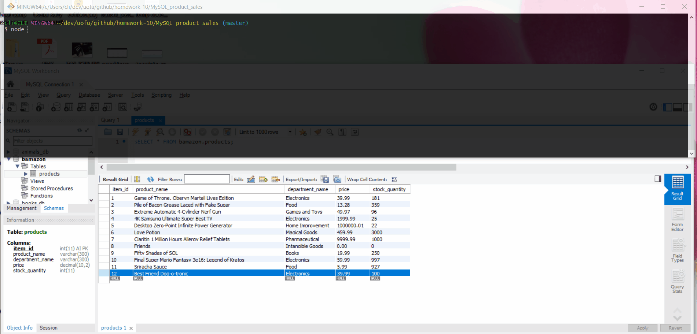

# MySQL_product_sales

## App Demo GIF

### Description
This assignment creates a database containing inventory that can be added, "purchased", or just displayed, via a combination of node, inquirer, and mysql.

There are two javascript files to execute via node:
* bamazonCustomer.js
* bamazonManager.js

Before anything can be run in this repo, you have to make sure you have both inquirer and mysql installed.
Run **npm install** to get those installed.

Start the files in terminal/gitbash by typing:
**node bamazonCustomer.js**
**node bamazonManager.js**

